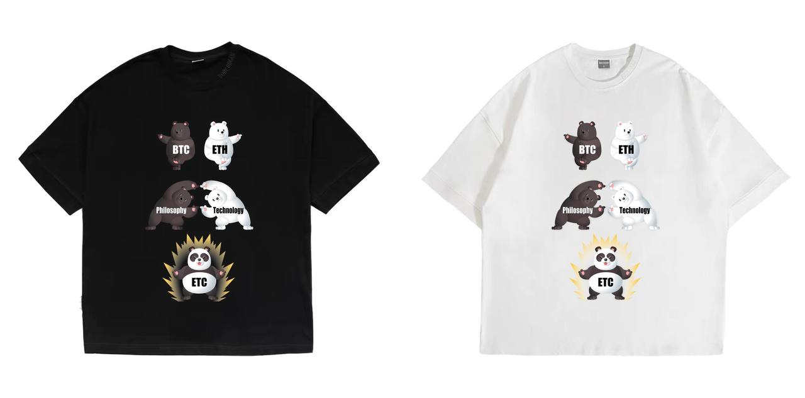

[这是来自我们比特大陆和蚂蚁矿机的朋友和合作伙伴的客座帖子]

2024年5月7~10日，比特币亚洲峰会（Bitcoin Asia）即将“龙”重开幕，和ETC Grants DAO核心团队在香港相聚吧！太平山下维港畔，聚焦比特币生态，共话Proof of Work！

【活动亮点】

5月7~8日，将在【香港科学园】举办比特币开发者大会（Bitcoin DevCon）。作为大会的深度合作伙伴，ETC Grants DAO将为大家分享新的一年的生态发展计划！

5月9~10日，BITCOIN ASIA主峰会将在香港【启德邮轮码头】举办。欢迎与会小伙伴在展台和ETC Grants DAO团队会面，一起#MakePoWGreatAgain，让人类数字世界更美好！

【ETC：“原初以太坊”】

2016年7月20日，以太坊社区经历了重要的分歧，开发团队强行通过硬分叉进行数据回滚。从此，以太坊的世界里分为两条道路：原初以太坊（ETC）和新的分叉链（ETH）。ETC是“原初以太坊”，是区块链不可篡改精神的捍卫者。
ETC=BTC+ETH！ETC继承了比特币的PoW共识机制，并在经济模型上与比特币保持一致，通过定期的减产机制对抗通胀。在EVM层面，作为“原初以太坊”，ETC从始至终都追随着以太坊的技术Roadmap，亦步亦趋，不做独立创新，保持与ETH的完全兼容。

ETC=POW+EVM！基于PoW共识带来的真正去中心化，和与ETH兼容的EVM，ETC将成为真正的全球计算机！同时，通过跨链桥和各种去中心化应用，ETC也可以支持并增强“数字黄金”比特币的可编程性，使其能够更好地服务于现代金融生态系统。

【特别福利】

在本次峰会中，ETC Grants DAO还特别为社区成员准备了精美的周边礼品，前往我们的展台打卡，即可免费领取！穿上代表#EthereumClassic的服饰，大声喊出ETC=BTC+ETH！

【如何参与？】

点击链接 https://lu.ma/lr05lxs7 或扫描下方二维码即可一键报名！我们还将随机选取报名小伙伴提供#BITCOIN ASIA免费门票福利，一起和ETC Grants DAO奔赴更好的明天吧！！！

---

*ETC Grants DAO是由以太经典信徒、支持者、建设者组成的非营利性自治组织，其核心成员包括BITMAIN, ANTPOOL, ETC Cooperative等。EGD旨在促进生态的壮大和以太经典的长远发展，当前，EGD致力于ETC底层技术生态建设。
请私信公众号或者通过 info@etcgrantsdao.com联系我们！*
