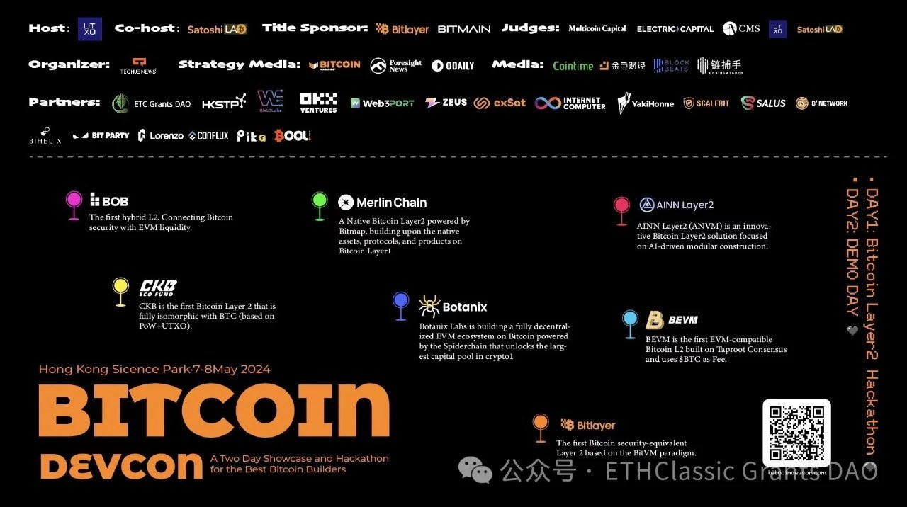

[This is a guest post from our friends and partners at Bitmain and Antminer]

From May 7 to 10, 2024, the Bitcoin Asia Summit will reopen with grandeur. Meet with the core team of ETC Grants DAO in Hong Kong! We'll focus on the Bitcoin ecosystem and discuss Proof of Work!

### Event Highlights

On May 7-8, the Bitcoin Developer Conference (Bitcoin DevCon) will be held at the Hong Kong Science Park. As a close conference partner, ETC Grants DAO will share our ecological development plan for the new year with everyone!

On May 9-10, the main summit of BITCOIN ASIA will be held at the Kai Tak Cruise Terminal in Hong Kong. We welcome friends attending the conference to meet at our booth with the ETC Grants DAO team. Let's #MakePoWGreatAgain and create a better digital world for humanity!

### ETC: "The Original Ethereum"

On July 20, 2016, the Ethereum community experienced a significant divergence, where the development team enforced a hard fork to roll back transactions. Since then, the world of Ethereum split into two paths: the Original Ethereum (ETC) and the new forked chain (ETH). ETC is the "Original Ethereum," a defender of the blockchain's immutable spirit.

ETC=BTC+ETH! ETC inherits Bitcoin's PoW consensus mechanism and aligns with Bitcoin's economic model by counteracting inflation with periodic halving. On the EVM level, as the "Original Ethereum," ETC has consistently followed Ethereum's technical roadmap, step by step, without isolated innovation, maintaining full compatibility with ETH.

ETC=POW+EVM! With true decentralization brought by the PoW consensus and compatibility with ETH's EVM, ETC is set to become the real global computer! Meanwhile, through cross-chain bridges and various decentralized applications, ETC can also support and enhance the programmability of "digital gold" Bitcoin, allowing it to serve the modern financial ecosystem better.

### Special Benefits

ETC Grants DAO has also prepared exquisite souvenirs for community members at this summit. Visit our booth to check in, and you can get these gifts for free! Wear clothing that represents #EthereumClassic and shout out loud ETC=BTC+ETH!

### How to Participate

Click the link https://lu.ma/lr05lxs7 or scan the QR code below to sign up in one click! We will also randomly select registered friends to offer free tickets to #BITCOIN ASIA, join ETC Grants DAO, and head towards the future!!!

*The ETC Grants DAO is a non-profit autonomous organization comprised of Ethereum Classic believers, supporters, and builders. BITMAIN, ANTPOOL, ETC Cooperative Etc. EGD aims to promote the growth of ecology and the long-term development of Ethereum Classic. EGD is currently committed to the ecological construction of ETC's underlying technology.*

*Please send an Official Account message template privately or via info@etcgrantsdao.com. Contact Us!*

